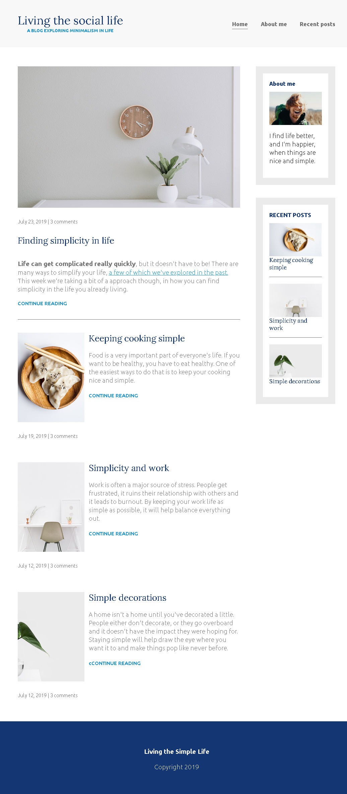
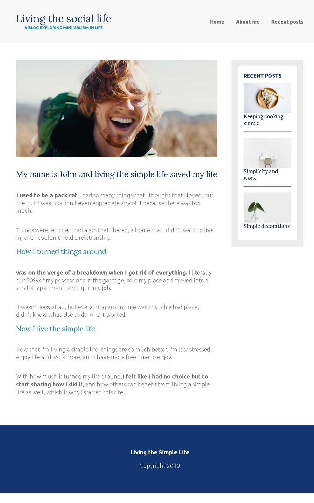
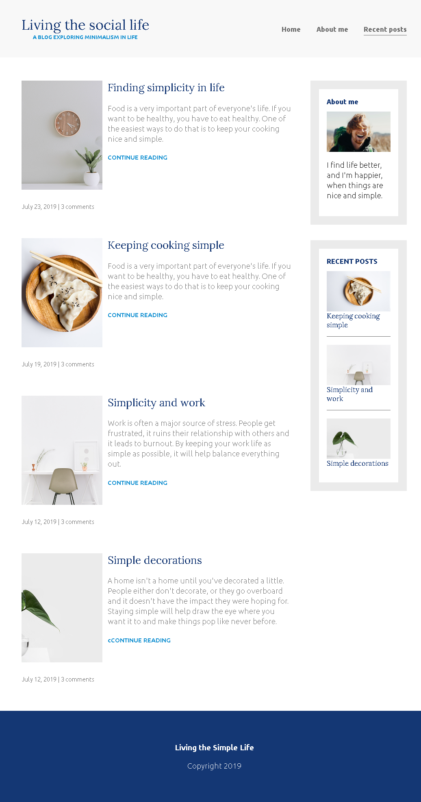

# Living-the-simple-life-responsive-design

its a blog about John's life as he living a simple one

### Responsive design

This website is built using responsive design principles, which allows it to adapt and display optimally on various devices and screen sizes. The layout and content of the website adjusts to the user's screen size, ensuring a seamless browsing experience on desktops, tablets, and smartphones.

## Screenshots

## 🔗 Links

## 🛠 Skills
React,js, Javascript, HTML, CSS...

